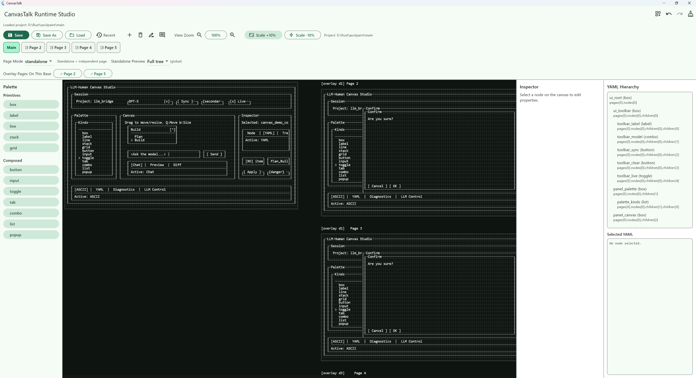

# CanvasTalk Runtime Studio

사람과 LLM이 같은 UI를 공유하기 위한 ASCII 캔버스 편집기 (Flutter Windows/Desktop).

## 핵심 컨셉

- 사람은 CanvasTalk 캔버스에서 UI를 직접 설계합니다.
- LLM은 로컬 소켓(`127.0.0.1`) 기반 Control API로 ASCII/YAML을 읽고, `POST /canvas/patch`로 UI를 직접 편집할 수 있습니다.
- 최종적으로 사람과 LLM이 동일한 UI 상태(ASCII + YAML)를 공유하며, 양방향으로 구현/수정 작업을 진행합니다.

## 주요 기능

- ASCII 캔버스 직접 편집: 선택, 이동(`Q`), 리사이즈(`W`), 핸들 조작
- 컴포넌트 팔레트: `box`, `label`, `line`, `stack`, `grid`, `button`, `input`, `toggle`, `tab`, `combo`, `list`, `popup`
- Kind별 프로퍼티 편집기 + 타입 힌트 (`string`, `int`, `bool`, `list<string>`)
- 노드별 `llmComment` 편집
- 우측 고정 YAML Hierarchy + 선택 노드 YAML 확인
- LLM 공유 출력: ASCII 복사, Markdown 내보내기, HTTP Control API
- 멀티 페이지 프로젝트
  - 페이지 탭 전환
  - 페이지 추가/삭제/이름변경
  - 페이지별 LLM 코멘트
- 프로젝트 저장/로드
  - 상단 컨트롤에서 `Save`, `Save As`, `Load`
  - 최근 프로젝트(Recent) 목록
  - 저장 성공/실패 팝업
- 로컬 HTTP Control API (`127.0.0.1`) 제공

## 스크린샷

스크린샷 파일을 `docs/screenshots`에 넣으면 README에서 바로 노출할 수 있습니다.

### 메인 캔버스



추가 스크린샷도 같은 방식으로 아래 경로에 넣어 확장하면 됩니다.

- `docs/screenshots/pages-overlays.png`
- `docs/screenshots/yaml-inspector.png`
- `docs/screenshots/llm-control.png`

## 협업 플로우 (권장)

1. CanvasTalk를 실행해서 UI를 구성합니다.
2. Codex 스킬(`ascii-ui-client-reader`)을 설치합니다.
3. LLM이 Control API에 접속해 ASCII/YAML을 읽습니다.
4. LLM 제안 패치(`canvas/patch`)를 적용하고, 사람이 캔버스에서 즉시 검수합니다.

## 실행

```bash
flutter pub get
flutter run -d windows
```

## 스킬 설치 (Codex)

버전관리되는 스킬 경로:

- `skills/ascii-ui-client-reader`

Windows PowerShell에서 로컬 Codex 스킬 폴더로 복사:

```powershell
New-Item -ItemType Directory -Force "$env:USERPROFILE\.codex\skills" | Out-Null
Copy-Item -Recurse -Force ".\skills\ascii-ui-client-reader" "$env:USERPROFILE\.codex\skills\ascii-ui-client-reader"
```

메인 문서:

- `skills/ascii-ui-client-reader/SKILL.md`
- `skills/ascii-ui-client-reader/references/flutter-kind-props.md`

## 빌드

```bash
flutter build windows --debug
```

## 단축키

- `Ctrl + Z`: Undo
- `Ctrl + Y` 또는 `Ctrl + Shift + Z`: Redo
- `Q`: Move 모드
- `W`: Resize 모드

## 프로젝트 저장 형식

- UI 본문: `<project-root>/ui/main.yaml`
- 메타: `<project-root>/project.yaml`
- 스냅샷: `<project-root>/.canvastalk/history/*.snapshot.yaml`
- 에디터 config(최근 프로젝트): `%USERPROFILE%/.canvastalk/config.json`

## HTTP API

서버는 실행 시 토큰을 발급합니다. (`/health` 제외 토큰 필요)

- `GET /health` (token 불필요)
- `POST /yaml/validate`
- `POST /render/preview`
- `POST /canvas/patch`
- `POST /project/load`
- `POST /project/save`
- `POST /session/reset`

요청 헤더:

- `x-canvastalk-token: <token>`

## LLM 소켓 연동 예시 (HTTP)

CanvasTalk는 로컬 루프백 소켓에서 HTTP API를 제공합니다.  
LLM은 `/render/preview` 결과의 `ascii` 필드를 받아 화면을 동일하게 인식할 수 있습니다.

```powershell
# 1) 헬스체크
Invoke-RestMethod -Method Get -Uri "http://127.0.0.1:<PORT>/health"

# 2) ASCII 프리뷰 요청 (토큰 필요)
$headers = @{ "x-canvastalk-token" = "<TOKEN>" }
$body = @{ yaml = (Get-Content .\ui\main.yaml -Raw) } | ConvertTo-Json
Invoke-RestMethod -Method Post -Uri "http://127.0.0.1:<PORT>/render/preview" -Headers $headers -ContentType "application/json" -Body $body
```

### patch 예시

```json
{
  "op": "set_bounds",
  "id": "demo_button",
  "x": 8,
  "y": 5,
  "width": 28,
  "height": 3
}
```

## 개발 검증

```bash
flutter analyze
flutter test
```

## Versioned Skill

ASCII -> 클라이언트 UI 구현용 Codex 스킬을 저장소에 함께 버전관리합니다.

- 경로: `skills/ascii-ui-client-reader`
- 메인 문서: `skills/ascii-ui-client-reader/SKILL.md`
- kind/props 매핑: `skills/ascii-ui-client-reader/references/flutter-kind-props.md`

필요 시 로컬 Codex 스킬 폴더(`%USERPROFILE%/.codex/skills`)로 복사해 사용할 수 있습니다.
